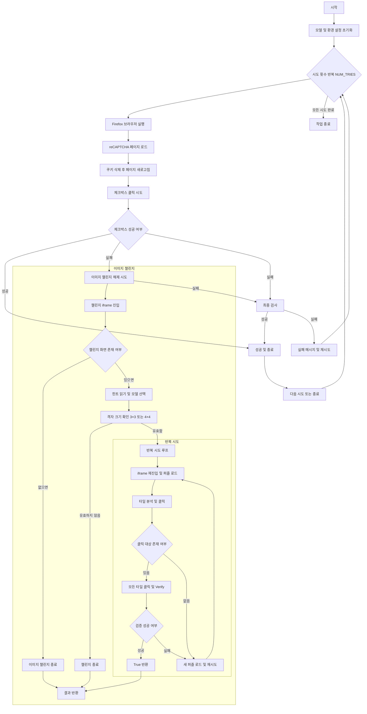

# breakrecapcha\_v2

`breakrecapcha_v2`는 Selenium과 YOLOv8 기반의 캡차(CAPTCHA) 이미지 셀렉션 챌린지를 자동으로 해결하는 도구입니다. 구글 reCAPTCHA V2의 이미지 퍼즐 챌린지를 사람이 클릭하듯 자연스럽게 풀어냅니다.

**만든 사람: jongcoding**

## 🚀 주요 기능


* Selenium을 이용한 브라우저 자동화 (Firefox)
* YOLOv8 분류·세그멘테이션 모델을 이용한 객체 검출 (파인튜닝된 `weights/final.pt` 포함)
* 3×3, 4×4 이미지 퍼즐 자동 인식 및 클릭
* 클릭 후 보드 변화 감지(이미지 diff)로 재시도 로직 지원
* 다양한 에러 처리(타일 없음, ‘더 많이 선택하세요’ 메시지 등)

### FLOW CHART

## 모델 평가
* Total runs: 30

* Successes: 27

* Succes.68srate: 100%

* Total time: 1080.27s

* Average time per run: 36.01s

## 🚀 모델 측정
### 3×3 퍼즐 클릭 디버깅 예시
<p align="center">
  
</p>

### 4×4 퍼즐 클릭 디버깅 예시
<p align="center">
  
</p>

## 🔧 개발 환경 설정

1. 가상환경 생성 및 활성화

   ```bash
   python -m venv venv
   # macOS/Linux
   source venv/bin/activate
   # Windows (PowerShell)
   .\venv\Scripts\Activate.ps1
   ```

2. 의존성 설치

   ```bash
   pip install -r requirements.txt
   ```

3. `requirements.txt` 갱신

   * PowerShell (UTF-8 인코딩 보장):

     ```powershell
     pip freeze | Out-File -FilePath .\requirements.txt -Encoding utf8
     ```
   * macOS/Linux 또는 CMD:

     ```bash
     python -m pip freeze > requirements.txt
     sudo apt update
     sudo apt install -y xvfb
     ```

## ⚙️ 사용 방법

1. 터미널에서 스크립트를 실행합니다:

   ```bash
   python main.py
   ```
   * macOS/Linux 또는 CMD:

     ```bash
     xvfb-run -s "-screen 0 1920x1080x24" python main.py
     ```
2. 해당모델의 성공확률을 보고싶다면:
    
   ```bash
   python evaluation.py
   ```

## 🔍 코드 구조

```
├── main.py               # 실행 스크립트
├── solver/               # 캡차 풀기 로직 모듈
│   ├── behavior.py       # 인간 같은 마우스 이동·클릭 유틸
│   └── image.py          # solve_3x3, solve_4x4, solve_until_done 구현
├── utils/
│   └── cookie.py         # Firefox 프로필 로드 유틸
├── weights/
│   ├── yolo_cls.pt       # 주 모델 가중치
│   ├── final.pt          # 파인튜닝된 분류 모델 가중치
│   └── yolo_seg.pt       # 세컨더리 세그멘테이션 모델
├── requirements.txt
└── README.md
```

## 🛠️ 주요 구성

* **`click_recaptcha_checkbox`**: reCAPTCHA 체크박스 클릭
* **`solve_image_challenge_if_present`**: 이미지 챌린지 흐름 제어 (iframe 전환, 모델 호출, 검증, 재시도)
* **`solve_until_done`**: 보드 클릭 반복 및 이미지 변화 감지(이미지 diff)
* **`check_recaptcha_solved`**: 최종 성공 여부 확인

## 🐛 디버깅

* 디버그 모드에서는 클릭 전후 보드 스냅샷(`debug_prev.png`, `debug_curr.png`)과 차이 이미지(`debug_diff.png`)가 저장됩니다.
* `diff.getbbox()` 로그를 통해 변화 영역을 확인하세요.

## 📜 라이선스

MIT 라이선스

---

````markdown
프로젝트에 기여하거나 이슈를 남기실 때는 언제든 환영합니다!```

````
